[](https://classroom.github.com/online_ide?assignment_repo_id=8538342&assignment_repo_type=AssignmentRepo)

<h1>React Native Bootcamp Assignment 6</h1>

This is an app like SnapChat, it has some functionalities such as sharing story, getting locations and more...

<h1>NativeBase TypeScript Expo Template</h1>

This project is created with official NativeBase TypeScript template for [Expo](https://docs.expo.io/)

<h2>Usage</h2>

```sh
expo init my-app --template @native-base/expo-template-typescript
```

<h2>Preview</h2>

<table style="width: 100%;">
<tbody>
  <tr>
    <td align="center"> Light Theme </td>
    <td align="center"> Dark Theme </td>
    <td align="center"> Animated View </td>
  </tr>
  </tbody>
</table>
<br/>
<p>Login Screen</p>
<div>
  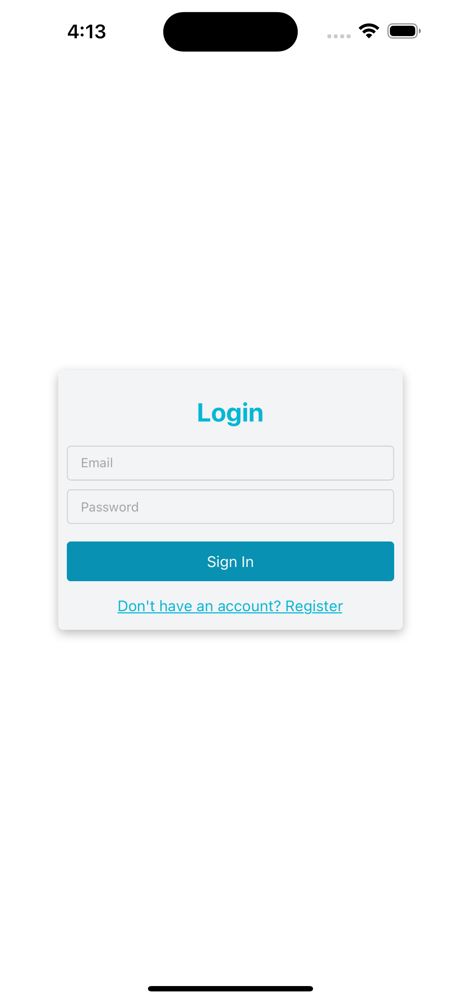
  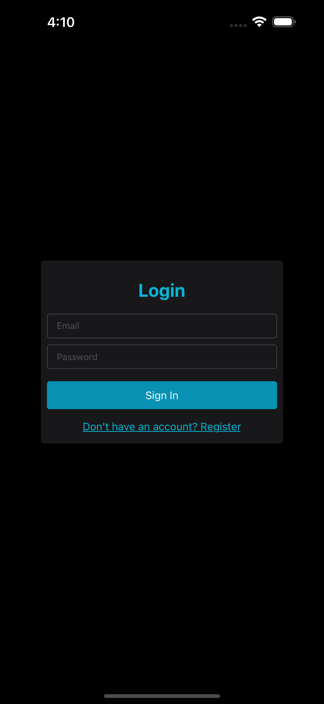
</div>
<br/>
<p>Register Screen</p>
<div>
  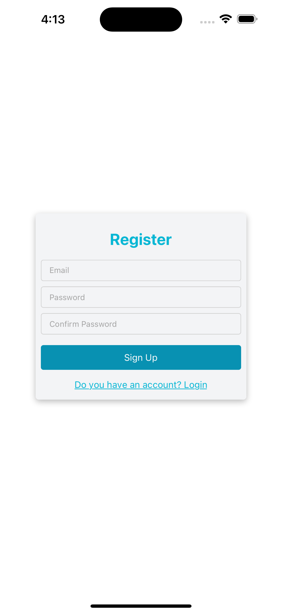
  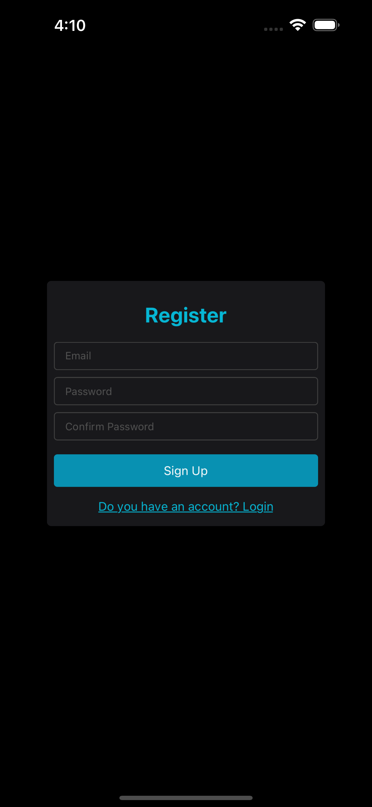
</div>
<br/>
<p>New Story Screen (Always Dark Mode)</p>
<div>
  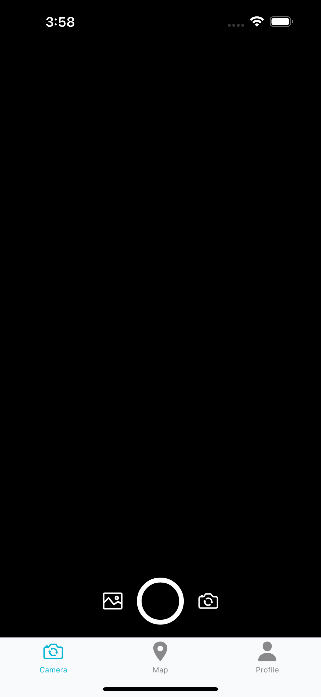
  
  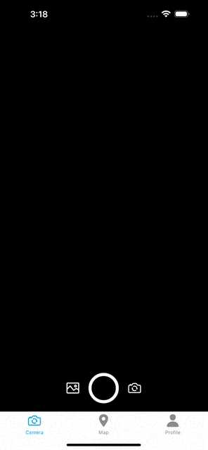
</div>
<br/>
<p>Map Screen iOS</p>
<div>
  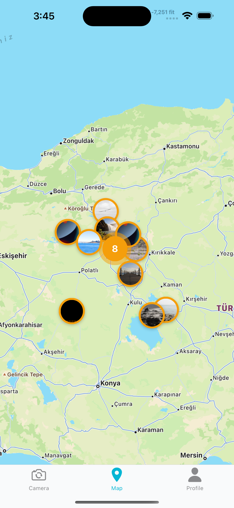
  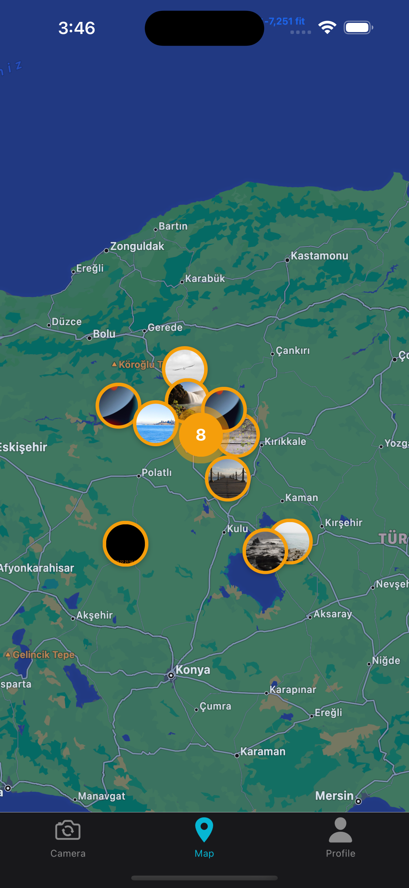
  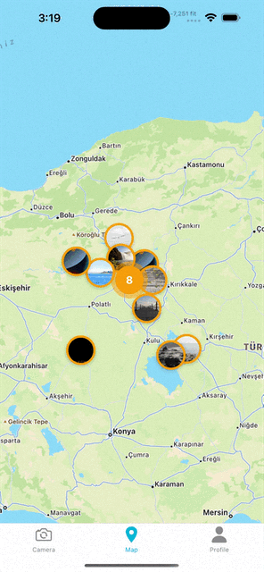
</div>
<br/>
<p>Map Screen Android</p>
<div>
  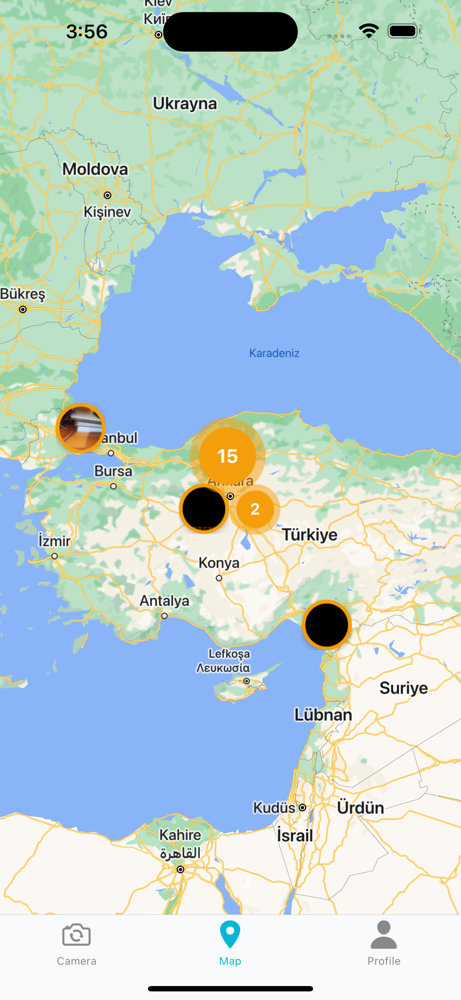
  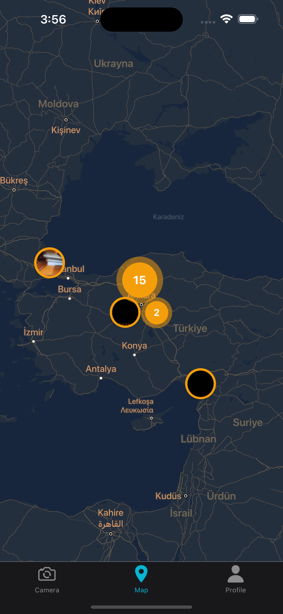
  
</div>
<br/>
<p>Profile Screen</p>
<div>
  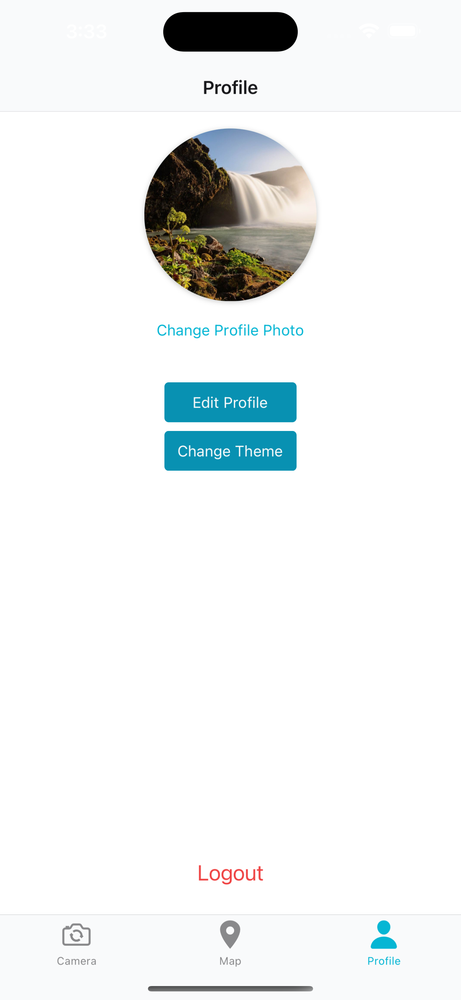
  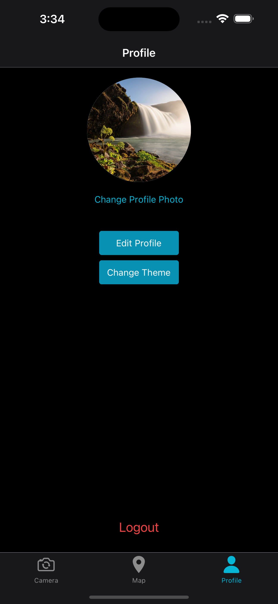
    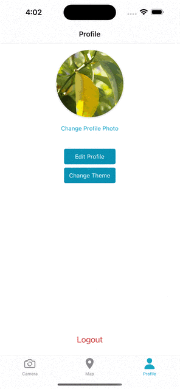
</div>
<br/>
<p>Edit Profile Screen</p>
<div>
  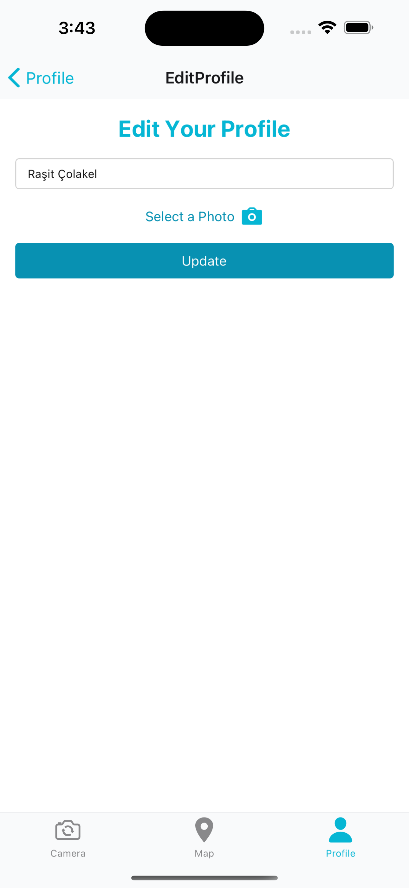
  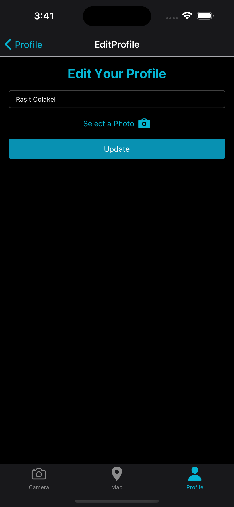
  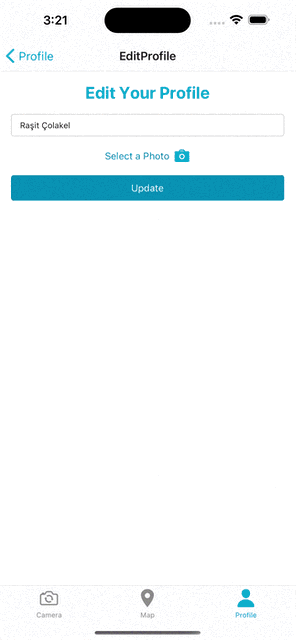
</div>
<br/>
<p>Settings Screen</p>
<div>
  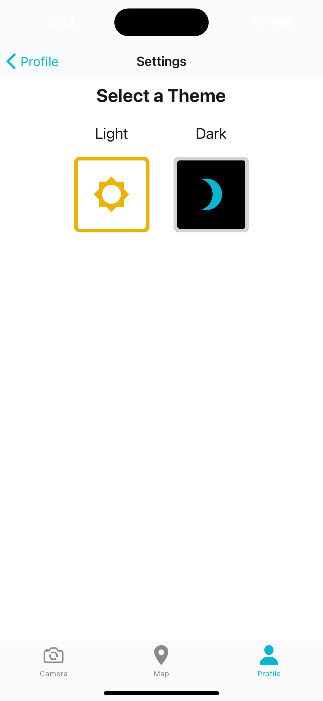
  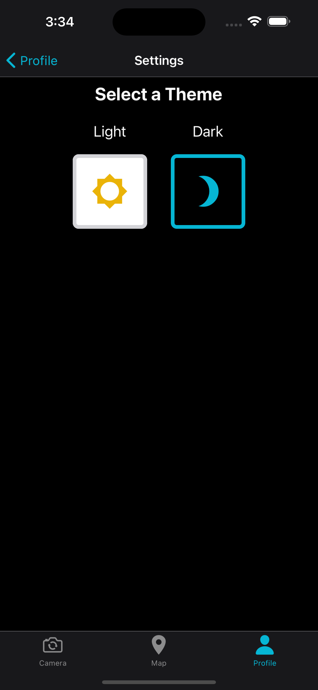
</div>

<br/>
<p>Logout Functionality</p>
<div>
  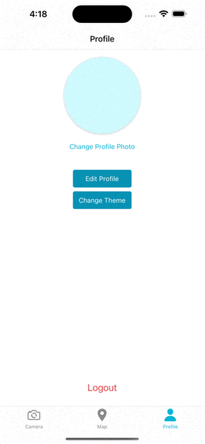

</div>

<br/>

<h3>Used Libraries and Dependencies</h3>

1. [NativeBase](#nativebase)
   1. [Installation](#nativebase-installation)
   2. [Usage](#nativebase-usage)
2. [React Navigation](#react-navigation)
   1. [Installation](#react-navigation-installation)
   2. [Usage](#react-navigation-usage)
3. [Firebase](#firebase)
   1. [Installation](#firebase-installation)
   2. [Usage](#firebase-usage)
4. [Redux](#redux)
   1. [Installation](#redux-installation)
   2. [Usage](#redux-usage)
5. [Redux Toolkit](#redux-toolkit)
   1. [Installation](#redux-toolkit-installation)
   2. [Usage](#redux-toolkit-usage)
6. [React Hook Form](#react-hook-form)
   1. [Installation](#react-hook-form-installation)
   2. [Usage](#react-hook-form-usage)
7. [Secure Store](#secure-store)]
   1. [Installation](#secure-store-installation)
   2. [Usage](#secure-store-usage)
8. [Expo Location](#expo-location)
   1. [Installation](#expo-location-installation)
   2. [Usage](#expo-location-usage)
9. [Expo Camera](#expo-camera)
   1. [Installation](#expo-camera-installation)
   2. [Usage](#expo-camera-usage)
   3. [How to take a picture](#expo-camera-how-to-take-a-picture)
   4. [How to switch the camera](#expo-camera-how-to-switch-camera)
10. [Expo Image Picker](#expo-image-picker)
    1. [Installation](#expo-image-picker-installation)
    2. [Usage](#expo-image-picker-usage)
    3. [How to pick an image](#expo-image-picker-how-to-pick-an-image)
11. [Expo Image Manipulator](#expo-image-manipulator)
    1. [Installation](#expo-image-manipulator-installation)
    2. [Usage](#expo-image-manipulator-usage)
12. [React Native Maps](#react-native-maps)
    1. [Installation](#react-native-maps-installation)
    2. [Usage](#react-native-maps-usage)
    3. [Adding Marker](#react-native-maps-adding-marker)
13. [React Native Maps Clustering](#react-native-maps-clustering)
    1. [Installation](#react-native-maps-clustering-installation)
    2. [Usage](#react-native-maps-clustering-usage)

<h3 id="nativebase">1. NativeBase</h3>
NativeBase is a free and open source UI component library for React Native to build native mobile apps for iOS and Android platforms. It is a framework of high-quality UI components for React Native to build native mobile apps for iOS and Android platforms. It is built on top of the React Native framework and it allows you to use the platform’s APIs natively.

<h4 id="nativebase-installation">Installation</h4>

```sh
npm install native-base --save
```

<h4 id="nativebase-usage">Usage</h4>

To use NativeBase components, wrap your root component with the NativeBaseProvider component.

```tsx
import { App } from './App';
import { NativeBaseProvider } from 'native-base';

export default function Main() {
  return (
    <NativeBaseProvider>
      <App />
    </NativeBaseProvider>
  );
}
```

<h3 id="react-navigation"> 2. React Navigation</h3>
React Navigation is a library that provides a way to navigate between screens in your app. It is built on top of the React Native API and provides a number of navigators that you can use to navigate between screens.

<h4 id="react-navigation-installation">Installation</h4>

```sh
npm install @react-navigation/native
# Dependencies for Expo Managed Project
npx expo install react-native-screens react-native-safe-area-context

# Bottom Tabs and Stack navigators
npm install @react-navigation/bottom-tabs @react-navigation/stack

npx expo install react-native-gesture-handler

```

<h4 id="react-navigation-usage">Usage</h4>

```tsx
import { NavigationContainer } from '@react-navigation/native';

function App() {
  return <NavigationContainer>...</NavigationContainer>;
}
```

<h3 id="firebase"> 3. Firebase</h3>
Firebase is a Backend-as-a-Service (BaaS) app development platform that provides hosted backend services such as a realtime database, cloud storage, authentication, crash reporting, machine learning, remote configuration, and hosting for your static files.

<h4 id="firebase-installation">Installation</h4>

```sh
npm install firebase
```

<h4 id="firebase-usage">Usage</h4>

```tsx
// Import the functions you need from the SDKs you need
import { initializeApp } from 'firebase/app';
import { getAuth } from 'firebase/auth';
import { getFirestore } from 'firebase/firestore';
import 'firebase/storage';

const firebaseConfig = {
  apiKey: '',
  authDomain: '',
  databaseURL: '',
  projectId: '',
  storageBucket: '',
  messagingSenderId: '',
  appId: '',
};

// Initialize Firebase
export const app = initializeApp(firebaseConfig);

// Initialize Firebase Auth to use signup and login
export const auth = getAuth(app);

// Initialize Firebase firestore to use database
export const db = getFirestore(app);
```

<h3 id="redux"> 4. Redux</h3>
Redux is a predictable state container for JavaScript apps. It helps you write applications that behave consistently, run in different environments (client, server, and native), and are easy to test. On top of that, it provides a great developer experience, such as live code editing combined with a time traveling debugger.

<h4 id="redux-installation">Installation</h4>

```sh
npm install redux react-redux
```

<h4 id="redux-usage">Usage</h4>

```tsx
import store from './store';
import { Provider } from 'react-redux';

function App() {
  return <Provider store={store}>{/* ... */}</Provider>;
}
```

<h3 id="redux-toolkit"> 5. Redux Toolkit</h3>
Redux Toolkit is the official, opinionated, batteries-included toolset for efficient Redux development. It is intended to be the standard way to write Redux logic.

<h4 id="redux-toolkit-installation">Installation</h4>

```sh
npm install @reduxjs/toolkit
```

<h4 id="redux-toolkit-usage">Usage</h4>

```tsx
import themeReducer from '../themeReducer';
import { configureStore } from '@reduxjs/toolkit';

export default configureStore({
  reducer: {
    theme: themeReducer,
  },
});
```

<h4 id="redux-toolkit-cat">createAsyncThunk</h4>
createAsyncThunk is a Redux Toolkit utility function for creating async action creators. It accepts a single string argument, which is used as the prefix for the generated action types, and a callback function that should return a Promise.

```tsx
import { createAsyncThunk } from '@reduxjs/toolkit';

/**
 *
 * createAsyncThunk will generate the following action types:
 *? user/login/pending
 *? user/login/fulfilled
 *? user/login/rejected
 */
const login = createAsyncThunk('user/login', async (credentials) => {
  const response = await fetch('/login', {
    method: 'POST',
    headers: {
      'Content-Type': 'application/json',
    },
    body: JSON.stringify(credentials),
  });

  if (!response.ok) {
    throw new Error(response.statusText);
  }

  return response.json();
});

/**
 * we can access the action types via the `login` object in extraReducers
 */

const userSlice = createSlice({
  name: 'user',
  initialState: {
    user: null,
  },
  reducers: {
    logout: (state) => {
      state.user = null;
    },
  },
  extraReducers: (builder) => {
    // when the login action is dispatched, the `pending` action type will be dispatched
    builder.addCase(login.pending, (state) => {
      state.status = 'loading';
    });
    // when the login action is fulfilled, the `fulfilled` action type will be dispatched
    builder.addCase(login.fulfilled, (state, action) => {
      state.user = action.payload;
    });
    // when the login action is rejected, the `rejected` action type will be dispatched
    builder.addCase(login.rejected, (state, action) => {
      state.status = 'failed';
      state.error = action.error.message;
    });
  },

```

<h3 id="react-hook-form"> 6. React Hook Form</h3>
React Hook Form is a performant, flexible and extensible forms with easy-to-use validation. It supports both uncontrolled and controlled components and will work with any UI library.

<h4 id="react-hook-form-installation">Installation</h4>

```sh
npm install react-hook-form
```

<h4 id="react-hook-form-usage">Usage</h4>

```tsx
import { useForm } from 'react-hook-form';

function App() {
  const { register, handleSubmit, setValue } = useForm();
  const onSubmit = (data) => console.log(data);

  return (
    <View>
      <TextInput
        name="firstName"
        ref={register}
        onChangeText={(text) => setValue('firstName', text)}
      />
      <TextInput
        name="lastName"
        ref={register}
        onChangeText={(text) => setValue('lastName', text)}
      />
      <Button title="Submit" onPress={handleSubmit(onSubmit)} />
    </View>
  );
}
```

<h3 id="secure-store"> 7. Secure Store</h3>
SecureStore is a key-value storage system that is similar to AsyncStorage, but provides a secure storage for sensitive data. SecureStore uses the Keychain Services on iOS and the Keystore on Android.

<h4 id="secure-store-installation">Installation</h4>

```sh
expo install expo-secure-store
```

<h4 id="secure-store-usage">Usage</h4>

```tsx
import * as SecureStore from 'expo-secure-store';

// setItem
await SecureStore.setItemAsync('key', 'value');

// getItem
const value = await SecureStore.getItemAsync('key');

// deleteItem
await SecureStore.deleteItemAsync('key');
```

<h3 id="expo-location"> 8. Expo Location</h3>
Expo Location provides an API to interact with the user's location. It uses the native location API under the hood.

<h4 id="expo-location-installation">Installation</h4>

```sh
expo install expo-location
```

<h4 id="expo-location-usage">Usage</h4>

```tsx
import * as Location from 'expo-location';

// requestPermissionsAsync
const { status } = await Location.requestPermissionsAsync();

// getCurrentPositionAsync
const location = await Location.getCurrentPositionAsync({});
```

<h3 id="expo-camera"> 9. Expo Camera</h3>
Expo Camera is a component that allows you to render a camera view. It is a wrapper around the Camera component from react-native-camera.

<h4 id="expo-camera-installation">Installation</h4>

```sh
expo install expo-camera
```

<h4 id="expo-camera-usage">Usage</h4>

```tsx
import { Camera, CameraType } from 'expo-camera';

function App() {
  const [hasPermission, setHasPermission] = useState(null);
  const [type, setType] = useState(CameraType.back);

  useEffect(() => {
    (async () => {
      const { status } = await Camera.requestPermissionsAsync();
      setHasPermission(status === 'granted');
    })();
  }, []);

  if (hasPermission === null) {
    return <View />;
  }
  if (hasPermission === false) {
    return <Text>No access to camera</Text>;
  }
  return (
    <View style={{ flex: 1 }}>
      <Camera style={{ flex: 1 }} type={type} />
    </View>
  );
}
```

<h4 id="expo-camera-how-to-take-a-picture">How to take a picture</h4>

To take a picture, we need to use the takePictureAsync method from the ref of the Camera component.

```tsx
// add these lines into the App component
const cameraRef = useRef<Camera>(null);
const takePicture = async () => {
  const photo = await cameraRef.current?.takePictureAsync();
  console.log('photo', photo);
};

// add a ref to the Camera component
<Camera
  style={{ flex: 1 }}
  type={type}
  // add ref to the Camera component
  ref={cameraRef}
>
  <Button title="Take a Picture" onPress={takePicture} />;
</Camera>;
```

<h4 id="expo-camera-how-to-switch-camera">How to switch camera</h4>

To switch camera, we need to use the CameraType enum from expo-camera and set the type state.

```tsx
// add these lines into the App component
const [type, setType] = useState(CameraType.back);
const switchCamera = () => {
  setType(type === CameraType.back ? CameraType.front : CameraType.back);
};

// add a button to switch camera
<Button title="Switch Camera" onPress={switchCamera} />;
```

<h3 id="expo-image-picker"> 10. Expo Image Picker</h3>
Expo Image Picker is a component that allows you to pick an image from the user's library or take a picture with the camera.

<h4 id="expo-image-picker-installation">Installation</h4>

```sh
expo install expo-image-picker
```

<h4 id="expo-image-picker-usage">Usage</h4>

```tsx
import * as ImagePicker from 'expo-image-picker';

// requestPermissionsAsync
const { status } = await ImagePicker.requestCameraPermissionsAsync();

// launchImageLibraryAsync
const result = await ImagePicker.launchImageLibraryAsync({
  mediaTypes: ImagePicker.MediaTypeOptions.All,
  allowsEditing: true,
  aspect: [4, 3],
  quality: 1,
});
```

<h3 id="expo-image-manipulator"> 11. Expo Image Manipulator</h3>
Expo Image Manipulator is a component that allows you to manipulate an image. It is a wrapper around the ImageManipulator component from react-native-image-crop-picker. And I have used this library to resize the image before uploading it to the server.

<h4 id="expo-image-manipulator-installation">Installation</h4>

```sh
expo install expo-image-manipulator
```

<h4 id="expo-image-manipulator-usage">Usage</h4>

```tsx
import * as ImageManipulator from 'expo-image-manipulator';

// manipulateAsync
const resizedImage = await ImageManipulator.manipulateAsync(
  image.uri,
  [{ resize: { width: 300 } }],
  { compress: 1, format: ImageManipulator.SaveFormat.JPEG },
);
```

<h3 id="react-native-maps"> 12. React Native Maps</h3>
React Native Maps is a component that allows you to render a map view. It is a wrapper around the MapView component from react-native-maps.

<h4 id="react-native-maps-installation">Installation</h4>

```sh
expo install react-native-maps
```

<h4 id="react-native-maps-usage">Usage</h4>

```tsx
import MapView from 'react-native-maps';

function App() {
  return (
    <MapView
      style={{ flex: 1 }}
      initialRegion={{
        latitude: 37.78825,
        longitude: -122.4324,
        latitudeDelta: 0.0922,
        longitudeDelta: 0.0421,
      }}
    />
  );
}
```

<h4 id="react-native-maps-adding-marker">Adding Marker</h4>

```tsx
import MapView, { Marker } from 'react-native-maps';

function App() {
  return (
    <MapView
      style={{ flex: 1 }}
      initialRegion={{
        latitude: 37.78825,
        longitude: -122.4324,
        latitudeDelta: 0.0922,
        longitudeDelta: 0.0421,
      }}
    >
      <Marker
        coordinate={{
          latitude: 37.78825,
          longitude: -122.4324,
        }}
        title="My Marker"
        description="Some description"
      />
    </MapView>
  );
}
```

<h3 id="react-native-maps-clustering"> 13. React Native Maps Clustering</h3>
React Native Maps Clustering is a component that allows you to cluster the markers on the map.

<h4 id="react-native-maps-clustering-installation">Installation</h4>

```sh
 yarn add react-native-map-clustering
```

<h4 id="react-native-maps-clustering-usage">Usage</h4>

```tsx
import MapViewClustering from 'react-native-map-clustering';
import MapView, { Marker } from 'react-native-maps';

function App() {
  return (
    <MapViewClustering
      style={{ flex: 1 }}
      initialRegion={{
        latitude: 37.78825,
        longitude: -122.4324,
        latitudeDelta: 0.0922,
        longitudeDelta: 0.0421,
      }}
    >
      <Marker
        coordinate={{
          latitude: 37.78825,
          longitude: -122.4324,
        }}
        title="My Marker"
        description="Some description"
      />
    </MapViewClustering>
  );
}
```
